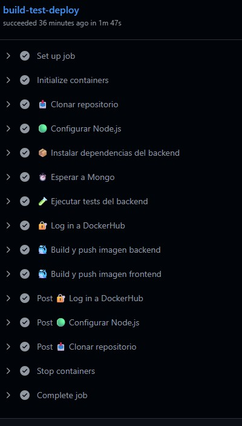
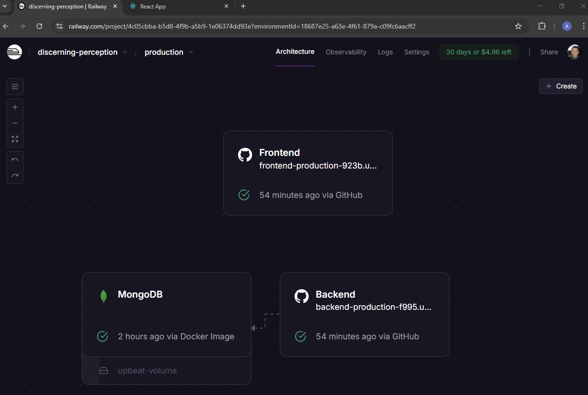

# 📝 TPI DevOps - ToDo List App

Aplicación desarrollada como Trabajo Práctico Integrador (TPI) para aplicar prácticas de DevOps: desarrollo, contenerización, testing y despliegue continuo.

Repositorio: [adrianagata011/TPI-Devops](https://github.com/adrianagata011/TPI-Devops)

---

## 🚀 Descripción

Se trata de una API REST sencilla para gestionar tareas (to-do list), desarrollada en **Node.js**, con persistencia en **MongoDB**, y con integración CI/CD mediante **GitHub Actions** y **Docker Hub**.

---

## 🛠️ Tecnologías utilizadas

- Node.js (Express)
- MongoDB (vía Mongoose)
- Docker y Docker Compose
- GitHub Actions (CI/CD)
- Jest + Supertest (testing)
- Docker Hub (almacenamiento de imágenes)
- Deploy en Producción (con Railway)

---

## 📦 Estructura del Proyecto

TPI_Devops/<br>
├── backend/<br>
│ └── src<br>
│ └── Dockerfile<br>
│ └── package.json<br>
├── frontend/<br>
│ └── public<br>
│ └── src<br>
│ └── Dockerfile<br>
│ └── package.json<br>
└── docker-compose.yml<br>
└── Readme.md<br>

---

## 🐳 Dockerización

Construcción e inicialización de las imagenes :

```bash
docker-compose up --build backend backend-test frontend
```
La app estará disponible en:

📍 http://localhost:3000

---

## 🧪 Testing

Los tests están automatizados con **Jest** y **Supertest** y ejecutan automaticamente al dockerizar las imagenes, y se pueden ver en el log de la consola:

```bash
backend-test-1  |
backend-test-1  | > backend@1.0.0 test
backend-test-1  | > jest
backend-test-1  |
backend-test-1  | PASS src/app.test.js
backend-test-1  |   API /tasks
backend-test-1  |     ✓ POST /tasks - debería crear una tarea (198 ms)
backend-test-1  |     ✓ GET /tasks - debería devolver la tarea creada (26 ms)
backend-test-1  |     ✓ PUT /tasks/:id - debería actualizar el estado done (24 ms)
backend-test-1  |     ✓ DELETE /tasks/:id - debería eliminar la tarea (10 ms)
backend-test-1  |
backend-test-1  | Test Suites: 1 passed, 1 total
backend-test-1  | Tests:       4 passed, 4 total
backend-test-1  | Snapshots:   0 total
backend-test-1  | Time:        1.465 s
backend-test-1  | Ran all test suites.
backend-test-1 exited with code 0
```

---

## ⚙️ CI/CD Automatizado con GitHub Actions

Este proyecto implementa un workflow de integración y despliegue continuo que se ejecuta automáticamente al hacer push en la rama `main`. El flujo incluye:

1. ✅ **Set up job**  
   Inicializa el entorno de ejecución de GitHub Actions.
2. ✅ **Initialize containers**  
   Crea y arranca los contenedores necesarios para MongoDB.
3. ✅ **📥 Clonar repositorio**  
   Clona el código fuente desde GitHub.
4. ✅ **🟢 Configurar Node.js**  
   Instala Node.js versión 18 y cachea dependencias.
5. ✅ **📦 Instalar dependencias del backend**  
   Ejecuta `npm install` en `/backend`.
6. ✅ **⏱️ Esperar a Mongo**  
   Espera la disponibilidad del contenedor de base de datos.
7. ✅ **🧪 Ejecutar tests del backend**  
   Corre tests automáticos con Jest y Supertest.
8. ✅ **🔐 Log in a DockerHub**  
   Autenticación segura en DockerHub con secretos.
9. ✅ **🐳 Build y push imagen backend**  
   Compila y publica la imagen Docker del backend.
10. ✅ **🐳 Build y push imagen frontend**  
    Compila y publica la imagen Docker del frontend.
11. ✅ **🧹 Post steps**  
    Cierra sesión de DockerHub y limpia recursos temporales.
12. ✅ **🛑 Stop containers**  
    Finaliza los servicios de testing (MongoDB).
13. ✅ **🏁 Complete job**  
    Cierra el proceso exitosamente.

## 📸 Capturas del pipeline



---

## 🐳 Docker Hub

Este proyecto publica automáticamente las imágenes Docker del backend y frontend en DockerHub utilizando GitHub Actions.

### 🔹 Backend

- 📦 Imagen: [`agataa011/tpi-backend`](https://hub.docker.com/r/agataa011/tpi-backend)
- Contiene el servidor Express y la lógica de conexión a MongoDB.

### 🔹 Frontend

- 📦 Imagen: [`agataa011/tpi-frontend`](https://hub.docker.com/r/agataa011/tpi-frontend)
- Incluye la aplicación React para la gestión de tareas.

Las imágenes se actualizan automáticamente en cada push a la rama `main`.

---

## 🚀 Despliegue en Railway

El proyecto está desplegado en [Railway](https://railway.app/), un servicio que permite desplegar aplicaciones full-stack con contenedores y bases de datos en la nube de forma rápida.

### 🔧 Arquitectura del Proyecto

El despliegue consta de tres servicios interconectados:

- 🧠 **MongoDB**: base de datos NoSQL alojada como contenedor.
- 🖥️ **Backend**: API REST construida con Node.js + Express.
- 🌐 **Frontend**: aplicación React que consume la API.

Los tres servicios fueron creados dentro de un **único proyecto Railway** para facilitar el monitoreo y administración compartida.

### 🌍 URLs de producción

- **Frontend:** [https://frontend-production-923b.up.railway.app](https://frontend-production-923b.up.railway.app)
- **Backend:** [https://backend-production-f995.up.railway.app](https://backend-production-f995.up.railway.app)

### 📦 Variables de entorno

En el servicio `Frontend` se configuró:

```env
REACT_APP_API_URL=https://backend-production-f995.up.railway.app
```

De esta manera, React construye la app con el backend apuntando al entorno de producción.

📸 Captura del despliegue



---

## 👥 Equipo de Trabajo

Este proyecto fue desarrollado por estudiantes de la Tecnicatura Superior en Desarrollo de Software:

| Nombre              | Rol                       |
|---------------------|---------------------------|
| Adrián Agata        | Coordinación técnica, CI/CD y despliegue |
| Ezequiel Frega      | Desarrollo backend (API REST, MongoDB) |
| Ricardo Gieco       | Desarrollo frontend (React, integración con API) |
| Alejandro Loredo    | Documentación, testing y soporte funcional |
| Trinidad Pasi       | Testing, validación y control de calidad |

---

## ✅ Conclusiones

Este proyecto permitió aplicar conceptos clave de DevOps en un entorno práctico, incluyendo la automatización de pruebas, la integración continua y la contenerización con Docker. Se logró así un entorno reproducible, escalable y fácilmente desplegable.
Además de recorrer las etapas tradicionales del ciclo de desarrollo de software, este proyecto nos expuso a las tareas propias del enfoque DevOps necesarias para llevar una idea desde su concepción hasta el despliegue en entornos de producción, utilizando herramientas de proveedores líderes del mercado como Railway.
Esto implicó realizar búsquedas en internet y leer documentación para poder ejecutar las tareas que el proyecto demandaba, lo cual asemeja este trabajo integrador a un escenario real del ámbito laboral en el ciclo de vida de un proyecto de software.
Si bien la aplicación desarrollada presenta una funcionalidad muy básica, el proyecto nos permitió explorar todas las etapas de dicho ciclo, incluyendo:
- Análisis de requerimientos
- Selección de tecnologías, definición de arquitectura e ingeniería de la solución
- Codificación
- Testeo manual de funcionalidades
- Uso de GitFlow como metodología de control de versiones

Y además, incorporar conceptos clave de DevOps en un entorno práctico, tales como:
- Automatización de pruebas
- Integración continua
- Contenerización con Docker

Todos estos procesos son perfectamente aplicables a proyectos de cualquier escala.

---

## 📄 Licencia
Uso académico – Tecnicatura en Desarrollo de Software
